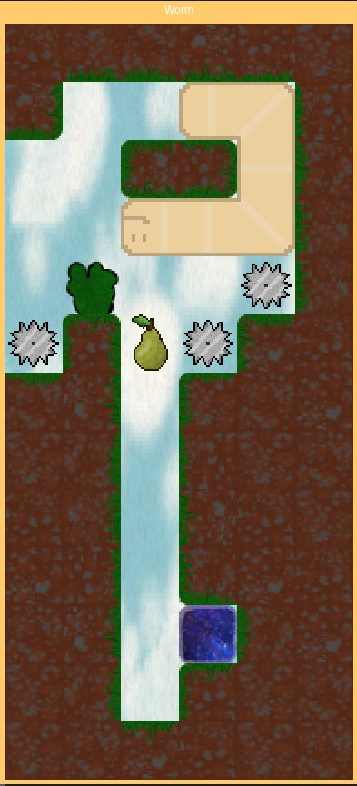

# Worm
Worm is a multi-level snake-like puzzle game we made for an AP Computer Science AB class. Release v1.0 was 
the version submitted for the assignment, and v1.1 contains a few minor 
improvements.

## Mechanics
 - The player controls a worm. The goal of the game is to make it to the goal/galaxy block.
 - The player's worm obeys gravity.
 - The player can move backwards if there's no block in the way.
 - The level restarts if the worm goes entirely offscreen.

## Blocks
 - The player can eat pears to grow longer but does not need to eat them all to win.
 - The level restarts if the worm falls into a shock block.
 - When the worm falls on a saw block, the worm gets split at the point of the saw, and the tail end gets removed.
   - If a worm is cut shorter than two tiles, the level restarts.
 - The player can push a push block with their head, and this push block does not obey gravity.

## Controls
 - W, A, S, D, or Up, Down, Left, and Right - Move snake in direction
 - R - Restart level

## Screenshots

